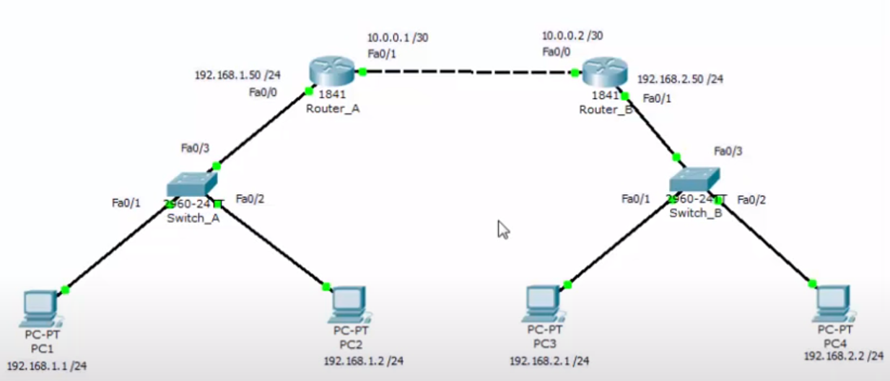

# Routage statique - Cisco Packet Tracer

#### Introduction

[Vidéo de documentation](https://www.youtube.com/watch?v=5dCtWJxz2mQ)


Le routage statique est une méthode de configuration manuelle des chemins que les données doivent emprunter dans un réseau informatique. Les administrateurs réseau définissent ces chemins manuellement sur les routeurs.

### Liste des commandes

##### Configuration

Note : Dans cette configuration, les gateway des ordinateurs doivent être sur l'addresse IP du routeur

##### Commandes
**Important, la manipulation doit se faire sur les deux routeurs**

1. Configuation IP du Routeur A
```sh
# Sur Routeur_A
en
conf t

# Configuration du routeur A
interface <nom interface> <numéro port>
# Ex : interface fastEthernet 0/0

# Configuration de l'adresse IP du routeur
ip address <adresse IP> <masque de sous réseau>
# Ex : ip address <192.168.1.50> <255.255.255.0>

no shutdown

exit

# Création de l'adresse IP du port qui connecte le routeur A au routeur B
interface nom interface> <numéro port>
# Ex : interface fastEthernet 0/1

# Configuration de l'adresse IP du routeur
ip address <adresse IP> <masque de sous réseau>
# Ex : ip address <10.0.0.1> <255.255.255.252>

no shutdown
```

2. Configuation IP du Routeur B
```sh
# Sur Routeur_B
en
conf t

# Configuration du routeur A
interface <nom interface> <numéro port>
# Ex : interface fastEthernet 0/1

# Configuration de l'adresse IP du routeur
ip address <adresse IP> <masque de sous réseau>
# Ex : ip address <192.168.1.50> <255.255.255.0>

no shutdown

exit

# Création de l'adresse IP du port qui connecte le routeur A au routeur B
interface nom interface> <numéro port>
# Ex : interface fastEthernet 0/0

# Configuration de l'adresse IP du routeur
ip address <adresse IP> <masque de sous réseau>
# Ex : ip address <10.0.0.1> <255.255.255.252>

no shutdown
```

À présent si l'on essaye de faire un ping entre le PC1 et le PC4, il va nous renvoyé "Destination Host unreachable". Il faut donc créer la route.

3. Configuration de la route sur Switch A

```sh
# Sur Routeur_B
en
# Affichage des routes d'un switch
show ip route

conf t

# Création de route vers le réseau de destination
ip route <réseau de destination> <masque de sous réseau du réseau de destination> <interface par laquelle est relié le routeur de destination> <numéro de l'interface>
# Ex : ip route 192.168.2.0 255.255.255.0 fastEthernet 0/1

exit
```

3. Configuration de la route sur Switch B

```sh
# Sur Routeur_B
en
# Affichage des routes d'un switch
show ip route

conf t

# Création de route vers le réseau de destination
ip route <réseau de destination> <masque de sous réseau du réseau de destination> <interface par laquelle est relié le routeur de destination> <numéro de l'interface>
# Ex : ip route 192.168.1.0 255.255.255.0 fastEthernet 0/0

exit
```