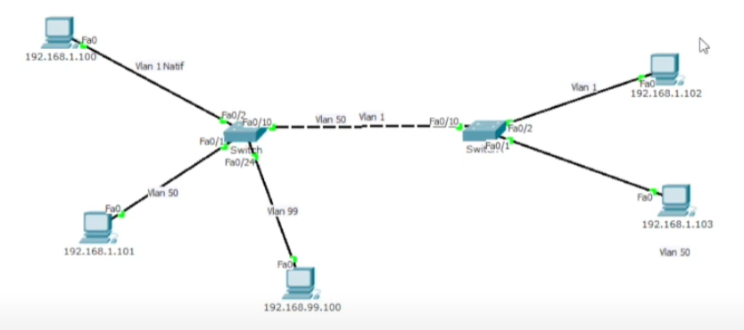

# Creation de Trunk - Cisco Packet Tracer

### Introduction 

[Vidéo de documentation](https://www.youtube.com/watch?v=pOOIiBQ5Hjs)

Si l'on connecte deux switch entre eux, les vlan seront partagé tant que le port qui les connecte est dans la même vlan. Par conséquent un ordinateur étant dans le vlan 1 du routeur 1 pourra accéder, à un ordinateur qui est connecté à un routeur 2 tant que ce dernier se trouve dans la même vlan que lui, le 1. Le cable croisé qui connecte des deux switchs doit égalment être connecté à un port de vlan 1.
Cependant, il est possible de connecter deux vlan par un seul cable croisé entre deux switch, voilà l'utilité des trunk.

### Liste des commandes

Note : Aller dans le fichier [Vlan.md](./Vlan.md) pour connaitre la marche à suivre pour gérer les Vlan.

##### Configuration


##### Commandes

Passer un port en mode trunk
**Important : il faut passer les ports en mode trunk sur les deux switch**

```sh
en
conf t

# Permet d'aller dans l'interface du port
interface fastEthernet <numero de port>
# Ex : interface fastEthernet 0/10

# Passage du port en mode trunk
switchport mode trunk

# Choix des vlan à attribuer
# Ajout d'une vlan au port
switchport allowed vlan <numéro vlan>
# Ajout de plusieurs Vlan
switchport allowed vlan <numéro de la première vlan>-<numéro de la dernière vlan>
```

Vérification de la configuration
```sh
en
# Permet d'afficher les interfaces (ports) et leur configuration
show running-config

# Affiche les trunk
show interfaces trunk
```
